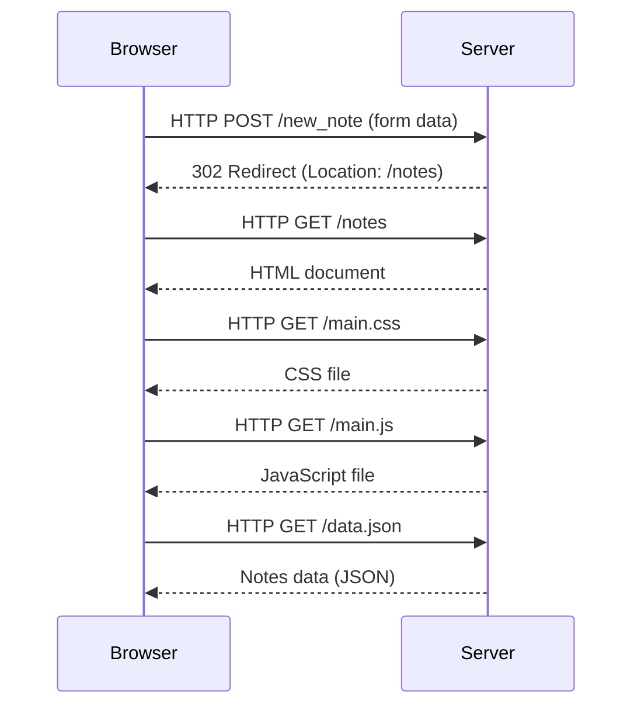

```mermaid
sequenceDiagram
participant Browser
participant Server

    Browser->>Server: HTTP POST /new_note (form data)
    Server-->>Browser: 302 Redirect (Location: /notes)

    Browser->>Server: HTTP GET /notes
    Server-->>Browser: HTML document

    Browser->>Server: HTTP GET /main.css
    Server-->>Browser: CSS file

    Browser->>Server: HTTP GET /main.js
    Server-->>Browser: JavaScript file

    Browser->>Server: HTTP GET /data.json
    Server-->>Browser: Notes data (JSON)
```
